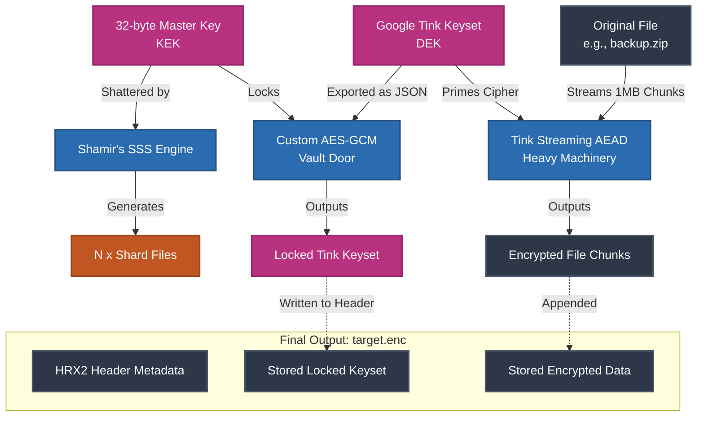

# Horcrux

A cryptographic file encryption and secret sharing CLI written in Go.

Horcrux secures your files using enterprise-grade Envelope Encryption. It encrypts your target file using Google Tink (Streaming AEAD), and then uses Shamir's Secret Sharing (SSS) to shatter the master encryption key into distinct mathematical shards. 

You specify a "threshold", the minimum number of shards required to rebuild the key and decrypt the file. If an attacker compromises your machine but gets fewer shards than your threshold, they learn absolutely nothing about your data.

## Architecture & Design

Encryption flowchart


The core engine is built for memory safety and zero-knowledge storage. It is capable of encrypting massive files (like gigabyte-sized database backups) without consuming excessive RAM.

* **Data Encryption Key (DEK):** Managed by **Google Tink**. Handles the heavy lifting of streaming large files securely to disk using AES-256-GCM-HKDF.
* **Key Encryption Key (KEK):** A randomly generated 32-byte key used to lock the DEK vault. This KEK is the secret that is mathematically shattered by the Shamir engine.
* **Custom File Format (`HRX2`):** Implements a custom binary metadata header to safely store the locked Tink keyset, verify file integrity, and flawlessly restore the original file extension upon decryption.
* **Failsafes:** Built-in OS-level protections prevent accidental data overwrites during the decryption phase, ensuring user data is never silently destroyed.

## Getting Started

### Installation
1. Clone the repository:
   ```bash
   git clone https://github.com/prathampatel/horcrux.git
   cd horcrux
   ```
2. Build the executable binary:
   ```bash
   go build -o horcrux main.go
   ```

### Usage

**1. Encrypting a file**
Use the `encrypt` command. You can specify the total number of shards to generate (`-s`) and the threshold needed to unlock (`-t`).

```bash
./horcrux encrypt my_secret_data.zip -s 5 -t 3
```
*This generates `my_secret_data.zip.enc` and 5 individual JSON `.shard` files. **Warning:** Move these shards to separate physical or digital locations (USB drives, password managers) and delete the local copies!*

**2. Decrypting a file**
To unlock the file, use the `decrypt` command and provide the paths to at least the threshold number of shards.

```bash
./horcrux decrypt my_secret_data.zip.enc -s my_secret_data.zip.shard1,my_secret_data.zip.shard3,my_secret_data.zip.shard5
```
*The engine will integrate the mathematical weights, rebuild the master key, unlock the Tink keyset, and perfectly restore your original `my_secret_data.zip` file.*

## Dependencies
* [Cobra](https://github.com/spf13/cobra) - CLI framework orchestration
* [Google Tink](https://github.com/tink-crypto/tink-go) - Enterprise cryptography engine
* [Testify](https://github.com/stretchr/testify) - Automated test assertions
